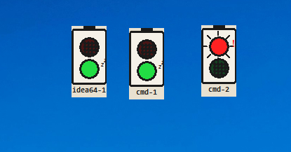

# Claude Traffic Light | Claude 红绿灯



开了好几个 Claude Code 窗口，根本分不清哪个在跑、哪个在等你？？

这个小工具帮你搞定 —— 每个终端窗口头顶一盏漫画风红绿灯，状态一目了然！

## 亮点功能

- 🔴 **红灯亮了** — Claude 正在疯狂输出中，别打扰它
- 🟢 **绿灯亮了** — Claude 等你输入啦，快去翻牌子
- 🖱️ **双击灯** — 秒切到对应终端窗口，不用满屏找
- ✋ **拖拽移动** — 想放哪放哪，桌面布局随心配
- 📌 **系统托盘** — 右键一键退出，干净利落

## 上手超简单

1. 下载 `ClaudeTrafficLight.exe`，双击打开就行
2. 开一个 Claude Code 终端 → 红绿灯自动出现
3. 不用了？托盘右键 → Quit，拜拜

> 零配置，开箱即用，小白友好

## 自己构建

```bash
pip install psutil pywin32 pyinstaller
pyinstaller --onefile --windowed --name ClaudeTrafficLight --icon icon.ico --add-data "icon.ico;." claude_traffic_light.py
```

## 开源协议

MIT — 随便用，玩得开心
